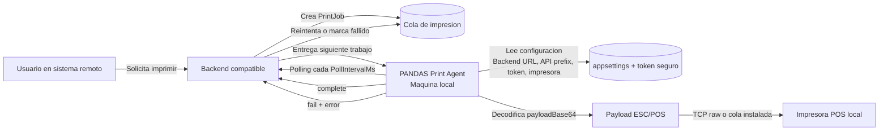
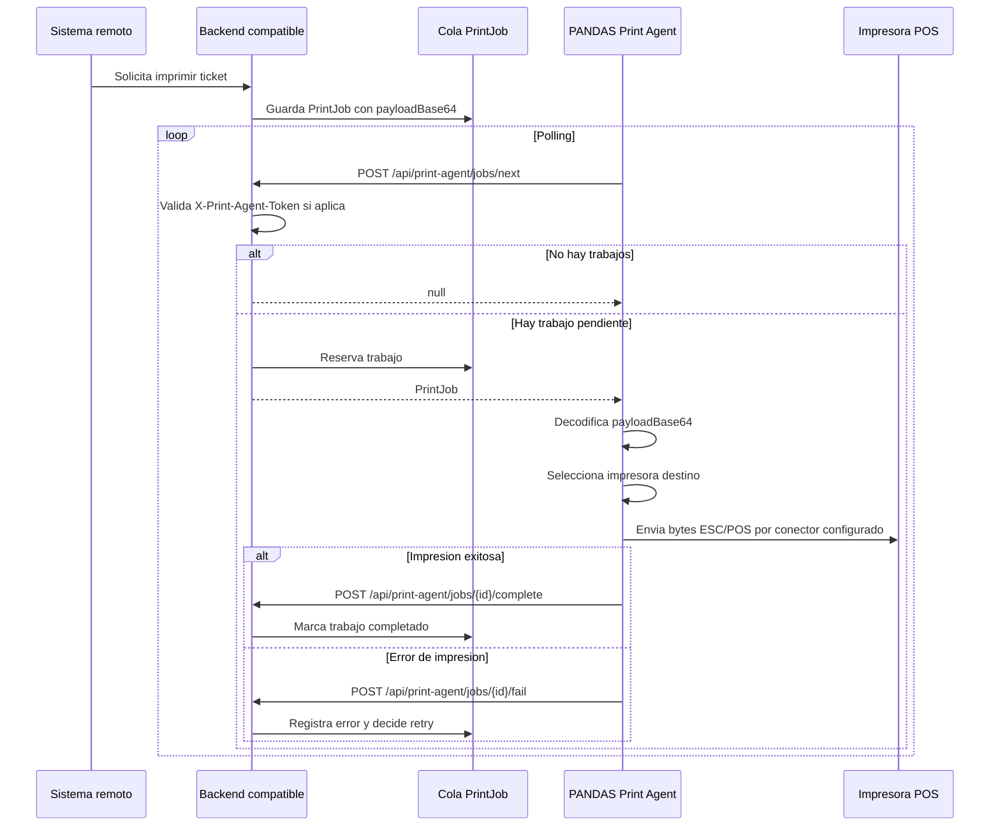
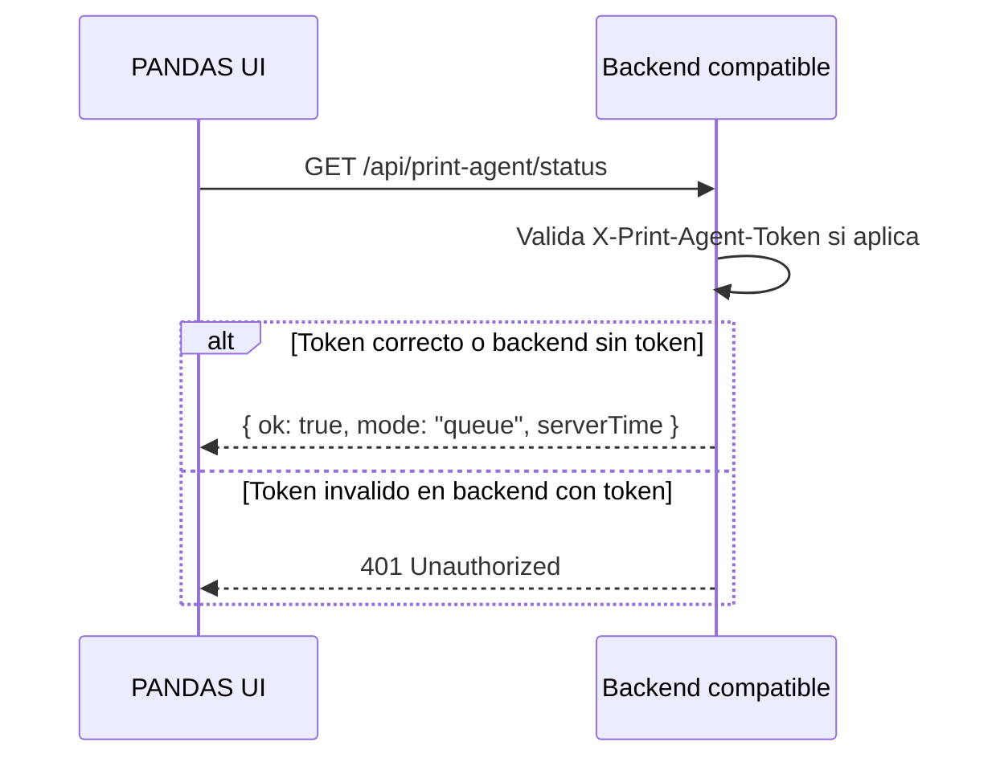

# PANDAS Print Agent

PANDAS Print Agent es una aplicacion local de escritorio para imprimir tickets POS desde un backend remoto hacia una impresora fisica ESC/POS dentro de una red local o una impresora instalada en el sistema.

PANDAS es generico por diseno. No esta ligado a un backend, ERP, tienda o proveedor especifico. Para funcionar solo necesita que el backend implemente el contrato HTTP esperado y entregue payloads ESC/POS listos para imprimir. El token de agente es opcional: puede usarse en produccion, pero puede quedar vacio para pruebas o backends que no exigen firma por token.

## Tabla de contenidos

- [Que problema resuelve](#que-problema-resuelve)
- [Como funciona](#como-funciona)
- [Estructura del proyecto](#estructura-del-proyecto)
- [Aplicacion de escritorio](#aplicacion-de-escritorio)
- [Configuracion](#configuracion)
- [Contrato del backend](#contrato-del-backend)
- [Modelo de PrintJob](#modelo-de-printjob)
- [Requisitos de cola en el backend](#requisitos-de-cola-en-el-backend)
- [Levantar en desarrollo](#levantar-en-desarrollo)
- [Publicar builds](#publicar-builds)
- [Instalador y updates con Velopack](#instalador-y-updates-con-velopack)
- [Guia de operacion](#guia-de-operacion)
- [Diagnostico y soporte](#diagnostico-y-soporte)
- [Seguridad](#seguridad)
- [Alcance actual](#alcance-actual)

## Que Problema Resuelve

Un backend en la nube normalmente no puede conectarse directamente a impresoras que viven dentro de una red privada o conectadas fisicamente a una computadora. Las impresoras POS de red suelen tener IPs locales, por ejemplo `10.0.0.28`, y reciben bytes ESC/POS por TCP raw en el puerto `9100`; las USB/Bluetooth normalmente se exponen como una impresora instalada del sistema operativo.

PANDAS resuelve esto ejecutandose en una computadora que si esta dentro de la red local de la impresora.

Flujo basico:

1. Un usuario solicita imprimir un ticket desde un sistema remoto.
2. El backend crea un trabajo de impresion en cola.
3. PANDAS consulta el backend desde la maquina local.
4. PANDAS recibe el trabajo y decodifica el payload ESC/POS.
5. PANDAS envia los bytes a la impresora POS por el conector configurado.
6. PANDAS informa al backend si el trabajo fue completado o fallo.

PANDAS sirve para:

- Imprimir tickets POS desde sistemas cloud.
- Evitar exponer impresoras locales a internet.
- Centralizar trabajos de impresion en una cola backend.
- Reintentar o diagnosticar impresiones fallidas.
- Probar conectividad de impresora sin depender del backend.
- Guardar logs locales y payload dumps opcionales para soporte.

## Como Funciona

### Arquitectura general



### Secuencia de impresion



### Status sin consumir trabajos

PANDAS usa un endpoint de status para validar conectividad y token sin reclamar trabajos reales.



## Estructura Del Proyecto

```text
pandas-print-agent/
  Pandas.PrintAgent.sln
  Pandas.PrintAgent/
  Pandas.PrintAgent.App/
  Pandas.PrintAgent.Core/
  Pandas.PrintAgent.Tests/
  docs.md
  publish-app.ps1
  publish-app-win-x64.ps1
  publish-app-linux-x64.ps1
  publish-app-osx-x64.ps1
  publish-app-osx-arm64.ps1
```

| Proyecto | Proposito |
| --- | --- |
| `Pandas.PrintAgent.App` | App desktop Avalonia con soporte de bandeja/menu bar. |
| `Pandas.PrintAgent` | Ejecutable CLI para diagnostico. |
| `Pandas.PrintAgent.Core` | Settings, cliente backend, worker, impresion, logs y token seguro. |
| `Pandas.PrintAgent.Tests` | Pruebas unitarias del core. |

## Aplicacion De Escritorio

El runtime recomendado es `Pandas.PrintAgent.App`.

La app permite configurar:

- Backend URL.
- API prefix.
- Token del agente, opcional si el backend no exige autenticacion por token.
- Conector de impresora: `WiFi/Ethernet (TCP)`, `USB` o `Bluetooth`.
- Host y puerto de impresora para red TCP.
- Dropdown de impresoras instaladas para USB/Bluetooth.
- Intervalo de polling.
- Timeout de impresora.
- Uso opcional de `targetHost` y `targetPort` enviados por el backend.
- Ruta de logs.
- Payload dumps opcionales.

Acciones principales:

| Accion | Comportamiento |
| --- | --- |
| `Guardar` | Guarda settings, guarda o limpia el token seguro, recarga el worker y valida status. |
| `Reload` | Reinicia el worker usando los valores actuales de la UI. |
| `Status` | Llama el endpoint de status sin consumir trabajos. |
| `Probar WiFi/Ethernet`, `Probar USB` o `Probar Bluetooth` | Envia una prueba ESC/POS directa al conector configurado. |
| `Abrir logs` | Abre el archivo o carpeta de logs. |
| `Salir` | Detiene el worker y cierra la app. |

Cerrar la ventana solo la oculta. El agente sigue corriendo desde la bandeja/menu bar hasta usar `Salir`.

## Configuracion

### appsettings.json

`appsettings.json` guarda solo datos no sensibles.

```json
{
  "BackendBaseUrl": "https://backend.example.com",
  "ApiPrefix": "api",
  "PollIntervalMs": 2000,
  "PrinterConnectorType": "NetworkTcp",
  "PrinterHost": "10.0.0.28",
  "PrinterPort": 9100,
  "PrinterQueueName": "",
  "PrinterTimeoutMs": 5000,
  "UseJobPrinterTarget": false,
  "LogFilePath": "logs/print-agent.log",
  "SavePayloads": false,
  "PayloadDumpDirectory": "logs/payloads"
}
```

### Conectores de impresora

PANDAS soporta tres opciones en la UI:

| Opcion | Como funciona | Configuracion requerida |
| --- | --- | --- |
| `WiFi/Ethernet (TCP)` | Usa socket TCP raw hacia la impresora. WiFi y Ethernet son el mismo mecanismo para PANDAS. | `PrinterHost` y `PrinterPort`. |
| `USB` | Envia ESC/POS raw a una impresora instalada en el sistema operativo. | Seleccionar una impresora instalada; se guarda como `PrinterQueueName`. |
| `Bluetooth` | Envia ESC/POS raw a una impresora Bluetooth instalada/emparejada en el sistema operativo. | Seleccionar una impresora instalada; se guarda como `PrinterQueueName`. |

Para USB y Bluetooth, primero instala o empareja la impresora en el sistema operativo. PANDAS muestra un dropdown con las impresoras instaladas detectadas para evitar que el usuario tenga que digitar el nombre manualmente. Si conectas o emparejas una impresora mientras PANDAS esta abierto, usa `Refrescar`.

En Windows, PANDAS lista y envia datos RAW a impresoras instaladas usando Winspool. En macOS y Linux, PANDAS lista impresoras con CUPS (`lpstat`) y envia datos RAW con `lp -o raw -d <PrinterQueueName>`.

### Token seguro

`AgentToken` es opcional. Si queda vacio, PANDAS no envia el header `X-Print-Agent-Token`.

Cuando se configura un token, no se vuelve a escribir en `appsettings.json` desde la GUI; se guarda en el almacen seguro del sistema operativo.

| Sistema | Almacen seguro |
| --- | --- |
| Windows | Credential Manager |
| macOS | Keychain |
| Linux | Secret Service via `secret-tool` |

En Linux, instala el paquete que provee `secret-tool`:

```bash
sudo apt-get install libsecret-tools
```

### Variables de entorno

Las variables de entorno pueden sobrescribir `appsettings.json`.

| Variable | Descripcion |
| --- | --- |
| `PANDAS_BACKEND_BASE_URL` | URL base del backend. |
| `PANDAS_API_PREFIX` | Prefijo de API, normalmente `api`. |
| `PANDAS_PRINT_AGENT_TOKEN` | Token del agente. Util para CLI/automatizacion. |
| `PANDAS_PRINTER_CONNECTOR` | Conector: `NetworkTcp`, `Usb` o `Bluetooth`. Tambien acepta `tcp`, `wifi`, `ethernet` y `bt`. |
| `PANDAS_PRINTER_HOST` | IP o hostname de la impresora. |
| `PANDAS_PRINTER_PORT` | Puerto TCP de la impresora. Normalmente `9100`. |
| `PANDAS_PRINTER_QUEUE_NAME` | Nombre de la impresora instalada para USB/Bluetooth. La UI lo llena al seleccionar desde el dropdown. |
| `PANDAS_POLL_INTERVAL_MS` | Intervalo de polling en milisegundos. |
| `PANDAS_PRINTER_TIMEOUT_MS` | Timeout del socket de impresora en milisegundos. |
| `PANDAS_USE_JOB_PRINTER_TARGET` | Usa `targetHost` y `targetPort` del trabajo cuando existen. |
| `PANDAS_PRINT_AGENT_LOG` | Ruta del archivo de log. |
| `PANDAS_SAVE_PAYLOADS` | Guarda payloads binarios recibidos para diagnostico. |
| `PANDAS_PAYLOAD_DUMP_DIRECTORY` | Carpeta para payload dumps. |
| `PANDAS_PRINT_AGENT_DATA_DIR` | Override opcional de la carpeta persistente de settings/logs/payloads. |

### Variables de update

La app instalada busca updates en GitHub Releases publicos. Por defecto usa:

```text
https://github.com/Seventty/pandas-print-agent
```

No hace falta crear archivos locales, copiar tokens ni configurar cada PC para que el autoupdate funcione.

| Variable | Descripcion |
| --- | --- |
| `PANDAS_UPDATE_GITHUB_REPO_URL` | Override opcional del repositorio GitHub que contiene los releases de Velopack. |
| `PANDAS_UPDATE_GITHUB_PRERELEASE` | `true` para considerar prereleases; `false` para stable. |
| `PANDAS_UPDATE_CHANNEL` | Canal de Velopack, por ejemplo `stable` o `beta`. |
| `PANDAS_UPDATE_AUTO_CHECK` | `true` para revisar updates al iniciar la app instalada. |

## Contrato Del Backend

Cualquier backend puede funcionar con PANDAS si implementa este contrato HTTP.

### Autenticacion opcional

El backend puede exigir token o funcionar sin token. Si exige token, todos los endpoints del agente deben validar:

```http
X-Print-Agent-Token: <token>
```

Si el backend exige token y el token no existe o es invalido, responder:

```http
401 Unauthorized
```

El token configurado en PANDAS debe coincidir con el token configurado en el backend. Si el backend no exige token, deja el campo de token vacio en PANDAS; en ese modo PANDAS no envia `X-Print-Agent-Token`.

### Endpoint de status

Usado por la UI para validar conectividad y credenciales sin consumir trabajos.

```http
GET /api/print-agent/status
X-Print-Agent-Token: <token>
```

El header `X-Print-Agent-Token` se omite cuando el token esta vacio.

Respuesta esperada:

```json
{
  "ok": true,
  "mode": "queue",
  "serverTime": "2026-06-05T00:00:00.000Z"
}
```

### Endpoint para tomar el siguiente trabajo

Usado por el loop de polling del worker para reservar el siguiente trabajo disponible.

```http
POST /api/print-agent/jobs/next
X-Print-Agent-Token: <token>
```

El header `X-Print-Agent-Token` se omite cuando el token esta vacio.

Si no hay trabajos disponibles, puede responder:

```json
null
```

Si hay trabajo, debe responder un objeto `PrintJob`.

### Endpoint para marcar completado

PANDAS lo llama despues de enviar el payload a la impresora correctamente.

```http
POST /api/print-agent/jobs/{id}/complete
X-Print-Agent-Token: <token>
```

El header `X-Print-Agent-Token` se omite cuando el token esta vacio.

El backend debe marcar el trabajo como completado y evitar que se vuelva a entregar.

### Endpoint para marcar fallido

PANDAS lo llama cuando no puede imprimir el trabajo.

```http
POST /api/print-agent/jobs/{id}/fail
X-Print-Agent-Token: <token>
Content-Type: application/json
```

El header `X-Print-Agent-Token` se omite cuando el token esta vacio.

Body esperado:

```json
{
  "error": "Mensaje describiendo el fallo de impresion"
}
```

El backend debe registrar el error y decidir si el trabajo puede reintentarse o si debe marcarse como fallido definitivamente.

## Modelo De PrintJob

PANDAS espera que el endpoint `jobs/next` devuelva esta forma:

```json
{
  "id": "job-123",
  "type": "ORDER",
  "reference": "0001",
  "payloadBase64": "BASE64_ESC_POS_BYTES",
  "targetHost": "10.0.0.28",
  "targetPort": 9100,
  "attempt": 1,
  "maxAttempts": 5
}
```

| Campo | Requerido | Descripcion |
| --- | --- | --- |
| `id` | Si | Identificador unico del trabajo. |
| `type` | Recomendado | Tipo logico, por ejemplo `ORDER`, `INVOICE` o `RECEIPT`. |
| `reference` | Recomendado | Referencia humana util para logs. |
| `payloadBase64` | Si | Bytes ESC/POS codificados en base64. |
| `targetHost` | Opcional | IP o hostname de impresora enviado por el backend. |
| `targetPort` | Opcional | Puerto TCP de impresora enviado por el backend. |
| `attempt` | Recomendado | Intento actual de impresion. |
| `maxAttempts` | Recomendado | Maximo de intentos permitidos. |

Si `UseJobPrinterTarget` esta desactivado en PANDAS, se usan `PrinterHost` y `PrinterPort` locales aunque el trabajo incluya `targetHost` y `targetPort`.

`UseJobPrinterTarget` solo aplica al conector `WiFi/Ethernet (TCP)`. En `USB` y `Bluetooth`, PANDAS siempre usa la impresora instalada configurada en `PrinterQueueName`.

## Requisitos De Cola En El Backend

El backend debe tratar los trabajos como una cola con transiciones claras.

Estados recomendados:

| Estado | Significado |
| --- | --- |
| `pending` | Trabajo disponible. |
| `processing` | Trabajo reservado por un agente. |
| `completed` | Trabajo impreso correctamente. |
| `failed` | Trabajo fallido definitivamente. |

Comportamiento recomendado:

- Reservar trabajos atomicamente para que dos agentes no impriman lo mismo.
- Usar timeout de `processing` para recuperar trabajos si una PC se apaga.
- Guardar el ultimo error recibido por `jobs/{id}/fail`.
- Manejar `attempt` y `maxAttempts`.
- Reintentar fallos transitorios solo hasta el maximo permitido.
- Evitar exponer IPs LAN de impresoras salvo que el despliegue lo requiera.

PANDAS no renderiza HTML ni PDF. El backend debe generar los bytes ESC/POS finales y enviarlos como `payloadBase64`.

## Levantar En Desarrollo

Requisitos:

- .NET SDK 8 o superior.
- PowerShell para scripts de publicacion.
- Backend compatible para pruebas end-to-end.
- Impresora POS de red, impresora USB/Bluetooth instalada, o listener TCP para pruebas de impresion.

Desde la raiz del repositorio:

```powershell
dotnet restore Pandas.PrintAgent.sln
dotnet build Pandas.PrintAgent.sln
dotnet test Pandas.PrintAgent.sln
```

Ejecutar la app desktop:

```powershell
dotnet run --project Pandas.PrintAgent.App
```

Ejecutar el CLI:

```powershell
dotnet run --project Pandas.PrintAgent
```

Enviar una prueba directa a la impresora sin backend:

```powershell
dotnet run --project Pandas.PrintAgent -- --test-print
```

## Publicar Builds

Los scripts generan builds self-contained. El usuario final no necesita instalar .NET.

### Windows x64

```powershell
.\publish-app-win-x64.ps1
```

Salida:

```text
Pandas.PrintAgent.App/publish/win-x64/
```

Ejecutar:

```powershell
.\Pandas.PrintAgent.App\publish\win-x64\Pandas.PrintAgent.App.exe
```

Autostart recomendado:

1. Presionar `Win + R`.
2. Ejecutar `shell:startup`.
3. Agregar un acceso directo a `Pandas.PrintAgent.App.exe`.

### Linux x64

```powershell
pwsh ./publish-app-linux-x64.ps1
```

Salida:

```text
Pandas.PrintAgent.App/publish/linux-x64/
```

Ejecutar:

```bash
cd Pandas.PrintAgent.App/publish/linux-x64
chmod +x Pandas.PrintAgent.App
./Pandas.PrintAgent.App
```

Para token seguro:

```bash
sudo apt-get install libsecret-tools
```

Archivo de autostart opcional:

```text
~/.config/autostart/pandas-print-agent.desktop
```

Ejemplo:

```ini
[Desktop Entry]
Type=Application
Name=PANDAS Print Agent
Exec=/path/to/pandas-print-agent/Pandas.PrintAgent.App/publish/linux-x64/Pandas.PrintAgent.App
Terminal=false
X-GNOME-Autostart-enabled=true
```

El soporte de tray depende del entorno de escritorio.

### macOS Intel

```powershell
pwsh ./publish-app-osx-x64.ps1
```

Salida:

```text
Pandas.PrintAgent.App/publish/osx-x64/
```

Ejecutar:

```bash
cd Pandas.PrintAgent.App/publish/osx-x64
chmod +x Pandas.PrintAgent.App
xattr -dr com.apple.quarantine .
./Pandas.PrintAgent.App
```

### macOS Apple Silicon

```powershell
pwsh ./publish-app-osx-arm64.ps1
```

Salida:

```text
Pandas.PrintAgent.App/publish/osx-arm64/
```

Ejecutar:

```bash
cd Pandas.PrintAgent.App/publish/osx-arm64
chmod +x Pandas.PrintAgent.App
xattr -dr com.apple.quarantine .
./Pandas.PrintAgent.App
```

La salida actual de macOS es un ejecutable publicado, no un bundle `.app` completo. Para distribuirlo de forma amigable en macOS, conviene empaquetarlo como `.app`, firmarlo, notarizarlo y distribuirlo en `.dmg` o `.pkg`.

## Instalador Y Updates Con Velopack

La app desktop integra Velopack para instalador y autoupdate. Al iniciar, `Program.cs` ejecuta `VelopackApp.Build().Run()` antes de crear Avalonia. El source de updates por defecto es el repositorio publico `https://github.com/Seventty/pandas-print-agent`.

### Datos persistentes

Los settings, logs y payload dumps ya no usan el folder instalado como base en la GUI/CLI. La ruta por defecto es:

| Sistema | Ruta |
| --- | --- |
| Windows | `%LocalAppData%\PANDAS\PrintAgent` |
| macOS | `~/Library/Application Support/PANDAS/PrintAgent` |
| Linux | `$XDG_CONFIG_HOME/pandas-print-agent` o `~/.config/pandas-print-agent` |

Puedes sobrescribirla con `PANDAS_PRINT_AGENT_DATA_DIR`.

### Source de updates

No se empaqueta ningun token de GitHub dentro del instalador. Como el repositorio es publico, Velopack puede leer releases directamente desde GitHub sin autenticacion.

Si necesitas probar contra otro repositorio publico o un fork, puedes sobrescribir temporalmente:

```powershell
$env:PANDAS_UPDATE_GITHUB_REPO_URL="https://github.com/OWNER/REPO"
```

### Empaquetar

Instala la CLI de Velopack:

```powershell
dotnet tool install -g vpk
```

Si ya esta instalada:

```powershell
dotnet tool update -g vpk
```

Generar publish + paquete Velopack para Windows:

```powershell
.\publish-app-win-x64.ps1 -Velopack -Version 1.0.0
```

Tambien puedes pasar la version mediante variable de entorno:

```powershell
$env:PANDAS_VELOPACK_PACK_VERSION="1.0.0"
.\publish-app-win-x64.ps1 -Velopack
```

MSI opcional en Windows:

```powershell
.\publish-app-win-x64.ps1 -Velopack -Msi -Version 1.0.0
```

Si tienes poco espacio en disco o el paquete anterior era muy grande, puedes generar solo full package sin delta:

```powershell
.\publish-app-win-x64.ps1 -Velopack -Version 1.0.5 -NoDelta
```

Los paquetes quedan por defecto en:

```text
releases/<runtime>/
```

### Publicar en GitHub Releases

Sube los assets generados por Velopack al GitHub Release correspondiente. Aunque el repositorio sea publico, necesitas un token con permiso de escritura para crear o actualizar releases. Ese token se usa solo en tu terminal o CI; no se empaqueta dentro de la app.

Usa el script de upload del repo para evitar publicar un tag que no coincida con la version real del paquete. El script valida `releases.<channel>.json`, `assets.<channel>.json` y el `.nupkg` full antes de llamar a `vpk upload`.

```powershell
$env:VPK_GITHUB_TOKEN="TU_TOKEN_WRITE"

.\upload-velopack-github.ps1 -Version 1.0.0 -Runtime win-x64 -Publish
```

Puedes validar sin subir nada:

```powershell
.\upload-velopack-github.ps1 -Version 1.0.0 -Runtime win-x64 -DryRun
```

El release debe estar publicado; si queda como draft, la app instalada no lo vera. Si creas `v1.0.5`, los assets deben contener paquetes `1.0.5`; no basta con cambiar el tag del release.

### Comportamiento de update en la app

La UI muestra la version actual. Cuando hay un update descargado, muestra `actual -> disponible` y habilita el boton `Reiniciar para actualizar`. El flujo implementado es:

1. Revisar updates al iniciar si `PANDAS_UPDATE_AUTO_CHECK=true`.
2. Descargar la nueva version en segundo plano.
3. Marcar el update como listo.
4. Aplicar solo con `Reiniciar para actualizar`.
5. Bloquear el reinicio si el worker esta imprimiendo.

## Guia De Operacion

Flujo tipico de instalacion:

1. Publicar la app para la plataforma correcta.
2. Copiar la carpeta publicada a la maquina local cercana a la impresora.
3. Ejecutar `Pandas.PrintAgent.App`.
4. Configurar `Backend URL`, `API prefix`, token si aplica e impresora.
5. Presionar `Guardar`.
6. Confirmar que el status quede conectado.
7. Presionar el boton dinamico `Probar WiFi/Ethernet`, `Probar USB` o `Probar Bluetooth`.
8. Dejar la app corriendo en bandeja/menu bar.
9. Configurar autostart si aplica.

Configuracion recomendada en produccion:

- Usar HTTPS para `BackendBaseUrl`.
- Usar un `PRINT_AGENT_TOKEN` unico por entorno o ubicacion cuando el backend exija token.
- Mantener `SavePayloads` apagado salvo diagnostico temporal.
- Mantener la maquina local encendida y conectada a la red de la impresora.
- Monitorear estados de cola y fallos repetidos desde el backend.

## Diagnostico Y Soporte

### Status muestra token invalido

Revisar:

- El token del backend y el token de PANDAS son identicos.
- No hay espacios antes o despues del token.
- El backend valida `X-Print-Agent-Token`.
- La UI se guardo despues de cambiar el token.
- Si el backend no debe exigir token, confirmar que no este rechazando requests sin `X-Print-Agent-Token`.

### Status muestra backend no alcanzable

Revisar:

- `BackendBaseUrl`.
- `ApiPrefix`.
- Conexion a internet o LAN.
- Certificado HTTPS.
- Disponibilidad del proceso backend.

Prueba manual:

```bash
curl https://backend.example.com/api/print-agent/status
curl -H "X-Print-Agent-Token: <token>" https://backend.example.com/api/print-agent/status
```

### La prueba de impresora no imprime

Revisar:

- IP de la impresora.
- Puerto de impresora, normalmente `9100`.
- La maquina local y la impresora estan en la misma red.
- La impresora tiene papel y la tapa esta cerrada.
- La impresora acepta RAW TCP.
- El firewall permite salida TCP hacia la impresora.

### El backend tiene trabajos pero no salen tickets

Revisar:

- PANDAS esta corriendo.
- El status del backend esta conectado.
- `PollIntervalMs` es razonable.
- Los trabajos no estan bloqueados en `processing`.
- Logs en `logs/print-agent.log`.
- `UseJobPrinterTarget` no apunta a una impresora inalcanzable.

### Los trabajos se imprimen duplicados

Revisar:

- La reserva del trabajo en el backend es atomica.
- El endpoint `complete` es idempotente.
- El timeout de `processing` no es demasiado corto.
- No hay multiples agentes usando la misma cola sin control de concurrencia.

## Seguridad

- No guardar tokens productivos en texto plano.
- Rotar tokens si se comparten accidentalmente.
- Preferir un token por entorno, tienda o despliegue cuando se use autenticacion por token.
- Evitar modo sin token en produccion salvo que exista otra capa de autenticacion o red privada controlada.
- Usar HTTPS para comunicacion con el backend.
- No dejar payload dumps activos en produccion salvo diagnostico temporal.
- Tratar payload dumps como informacion sensible: pueden contener datos comerciales o de clientes.

## Alcance Actual

Incluido:

- App desktop cross-platform con tray/menu bar.
- CLI de diagnostico.
- Worker de polling contra backend compatible.
- Impresion TCP ESC/POS directa.
- Almacenamiento seguro de token.
- Endpoint de status sin consumir trabajos.
- Scripts de publicacion self-contained.
- Pruebas unitarias del core.

No incluido todavia:

- Instalador Windows service.
- Instaladores MSI/PKG/DEB.
- Empaquetado macOS `.app` con firma y notarizacion.
- Unidad systemd para Linux.
- Multiples perfiles de impresora desde la UI.
- Dashboard remoto del agente.
